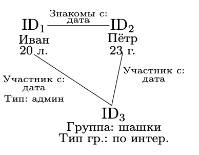

# 30. Двенадцать правил Дейта распределенных БД

1. **Локальная автономность**

    Локальные данные принедлежат локальным владельцам и локально сопровождаются (на каждом узле есть свой управленец БД и только он имеет к ним доступ управления)

2. **Отсутствие опоры на центральный узел**

    В системе не должно быть ни одного узла, без которого система не может функционировать

3. **Непрерывное функционирование**

    В системе не должна возникать потребность в плановом останове её функционирования

4. **Независимость от расположения**

    Любой пользователь может получить доступ к данным, хранящимся на любом узле

5. **Независимость от фрагментации**

    Любой пользователь может получить доступ к данным, вне зависимости от их фрагментации

6. **Независимость от репликации**

    Любой пользователь может получить доступ к данным, вне зависимости от наличия реплик

7. **Обработка распределённых запросов**

    Любой пользователь должен иметь возможность обработать любой запрос вне зависимости от количества узлов, на которых расположены запрашиваемые объекты данных

8. **Обработка распределённых транзакций**

    Система должна поддерживать выполнение транзакций с данными, расположенными более чем на одном узле

9. **Независимость от типа оборудования**

    Очев

10. **Независимость от сетевой архитектуры**

    Очев

11. **Независимость от операционной системы**

    Очев

12. **Независимость от типа СУБД**

    Очев

 

# 31. Предпосылки к появлению NoSQL баз данных

1. `BigData` - в последнее время началась работа со слишком большим количеством данных

2. Взяимосвязанность данных (косвенные связи) - сопоставив несколько разных баз данных, можно получить новые связи

3. Использование слабо-структурирвоанной информации (очень много конфигураций даже в рамках одной группы)

    - например, фильтры поиска телефона, где какие-то атрибуты могут присутствовать только у одного бренда, в связи с чем хранение такого массива данных в SQL таблице приводит к огромному количеству null значений и неиспользуемых аттрибутов

4. Изменение в архитектурах информационныъ систем - когда граф становится полносвязным, SQL становится очень неэффективным

> Если не получается сделать распределённую систему, давайте тогда **распределим ресурсы**

 

# 32. Общие характеристики NoSQL баз данных

1. Отказ от стандарта SQL (он есть, но со множеством отхождений)

2. **Schemaless** (неструктурированность)

    Мы можем менять что-то в структуре данных уже по дороге

3. **Aggregates**

    Впротивовес нормализованным SQL решениям мы пытаемся хранить данные как можно более сгруппированными _(отмена декомпозиции)_

    - Это связано с тем, что зачастую из миллиардов возможных комбинаций SQL запросов (аггрегатов таблиц), зачастую используется 30-50, отсюда и идея о том, чтобы сразу хранить данные в таком виде, в котором их было бы удобно запрашивать

    - Минус заключается в том, что при NoSQL, когда, всё-таки, приходится делать аггрегат данных, приходится фактически просматривать полностью всю базу данных для построения результата запроса

4. **Weak ACID** (Atomicity, Consistenss, Isolation, Durability)

    Транзакция в базе перестаёт сохранять указанные для неё в SQL свойства.

    - На смену ACID пришла другая модель BASE (Basic Avialability, Sost State, Eventual Consistens)

## BASE модель

1. Каждый запрос гарантированно завершается
2. Система может изменять данные даже без ввода или изменения данных извне
3. Конечная непротиворечимость

 

# 33. CAP теорема. Пример

`def` **CAP теорема** гласит, что в распределённой информационной системы возможно обеспечить не более двух из перечисленных свойств _(Consistency, Availability, Partition tolerance)_

## Целостность

- Во всех узлах в один момент времени данные не противоречат друг другу

- Два запроса в один момент времени к двум разным узлам, то результат выполнения обоих откликов будет одинаков

> Одинаковые результаты с любого узла в один момент времени

## Доступность

- Любой запрос к распределённой системе завершаеся корректным откликом в пределах заданного интервала времени, однако без гарантии, что отклики от всех узлов совпадут

## Устойчивость к распределению

- Расщепление распределённой системы на несколько изолированных секций не приводит к некоррекности отклика от каждой из секций

> CAP - треугольник

> Все реляционные БД - это `CA-системы`

___

## Пример

## 1. Централизованная система

Является C системой, так как всего один источник правды — + Consistency.

## 2. Решение — нанять компаньона (нет взаимосвязи между обработчиками)

Является A системой, так как при неисправности одного обработчика, может работать другой — +Availability.

Однако теряем Consistency, так как нету связи между источниками правды.

## 3. Принимаем решение о согласовании данных (Распределённая система с транзакционной репликацией данных)

Проблема доступности при недоступности хотя бы одного узла (пользователь ждёт пока я согласую ему запись, пока сам жду ответа от недоступного узла, так как он недоступен по каким-то причинам)

## 4. Распределение системы

  1. Распределённая система с гарантированной репликацией данных

      При звонке клиента пингуем второй узел на доступность. Если получем понг, то согласуем с ним данные, если нет, то кладём изменения в какую-то общую очереь и продолжаем работать.

      Когда узел поднимется, он первым делом из очереди прочитает изменения.

      Это CA система. Но нет Partition tolerance. Так как для соблюдения РТ нужен гарантированный канал связи. Если не пришёл отклик от узла, мы не знаем, это нет связи или узел действительно неактивен. Если положим в очередь, а на самом деле просто не было связи, когда связь восстановится, узел не будет знать о том, что в очереди что-то есть (так как он продолжал работать, просто связи не было). Таким образом получим некорректный отклик при разделении узлов.

  2. Распределённая система с гарантированным откликом

      Целостность данных в конечном счёте.
      AP система.

      После разговора с клиентом сразу рассылаю на все узлы в буфер данные, которые только что получил.

      Все узлы с какой-то переодичностью разбирают свои буферы.
      Тогда на длительном промежутке консистентность будет

  3. Распределённая система с гарантированной целостностью данных

      СР система.
      Невозможно обеспечить полную доступность.

      Блокируем запросы клиентов, если не удаётся подтведрдить статус узла.

 

# 34. NoSQL решения: хранилища ключ-значение и документоориентированные БД

## Key-Value DB (Cassandra)

Не храним отношения

**Есть только 3 операции:**

1. Insert (Key-Value)
2. Find (Key)
3. Remove (Key)

Гарантируется только уникальность ключа.
Как правило реализует АР класс.

**Недостатки:**

1. Может нарушиться уникальность ключа
2. Поиск только по ключу

## Document-oriented DB (MongoDB)

В качестве ключа обычно хранится значение, а вот в качестве значения уже хранится какая-то более сложная структура (Json, XML)

 

# 35. NoSQL решения: колоночные и графовые БД

## Column-based DB

1. Каждая колонка какого-то отношения хранится фактически как отдельная таблица

2. Хранение нескольких таблиц с дублированием ключевого аттрибута (в пределе переходит к форме ключ-значение)

> Могут быть CA и CP

## Graph DB

1. У узлов есть атрибуты, у связей тоже есть атрибуты
2. Граф кластеризуется таким образом, что узлы в одном кластере связаны значительно сильнее, чем узлы из разных кластеров. Кластеры хранятся отдельно.

> Например, в социальной сети граф можно разделить по принципу “кластер=жители конкретной страны” и хранить кластер, например, на серверах в этой стране.

**Плюсы:**

1. Удобно хранить информацию с неизвестной структурой
2. Удобно для хранения социальных сетей, онтологий, баз знаний

**Пролемы:**

1. Сложный поиск по аттрибутам, но лёгкий по связи.

 

# 36. База знаний. Определение, отличие от базы данных, замкнутые и открытые БЗ

`def` **База знаний** - это совокупность единиц знаний, которые представляют собой формализованные с помощью некоторого метода представления знаний отражение обхектов предметной области и их взаимосвязей, **действий** над объектами и, возможно, неопределённостей, с которыми эти действия осуществляются.

> База знаний != база данных

## Чем знания отличаются от данных

Считается что знания присущи только человеку _(**животные** - исключение)_.

`def` Данные - это факт, а знания - обработка этих данных.

`def` Данные не врут, а знания врут.

У человека есть воля (иногда), у ИИ - нет.

> В базе знаний есть некоторые "единицы" знаний

`def` **Единица знания** - результат формализации объектов проблемной области и их взаимосвязей.

> Всегда остаётся определённая неопределённость (С) А. В.

## Классификации баз знаний

1. Предполагающие неопределённость

2. Не предполагающие неопределённость

3. Открытые - постоянно получает подпитку новыми фактами (могут появляться противоречия)

4. Замкнутые - интерпретация содержимого в процессе функционирования не изменяется

> С технической точки в основе БЗ лежит БД, но в БД не делаем акцент на продукционность знаний

 

# 37. Логическая модель представления знаний

## Логическая модель

База знаний - совокупность из 4-х множеств (`M = <T, P, A, B>`)

`T` - алфавит, словарь
`P` - мн-во формул или синтакцических правил
`A` - аксиомы
`B` - мн-во правил вывода

С помощью этих 4-х множеств можно создать как открытую, так и закрытую базу знаний.

 

# 38. Сетевая модель представления знаний, семантическая сеть, онтология

## Сетевая модель

`H = <I, C_1, C_2, ..., C_n, G>`

`I` - информационные единицы

`C_1, ..., C_n` - множество типов связей

- a part of
- is a
- причинно-следственная связь
- временная связь

`G` - граф

> Классифицирующие сети
> Онтология - попытка увязать термины, события, факты и вообще всё
> СППР системы - системы поддержки принятия решения

 

# 39. Фреймовая модель представления знаний

## Фреймовая модель

`def` **Фрейм** - структура для описания стереотипной ситуации. Сотоит из некоторых характеристик этой ситуации (слотов) и их значений.

> Слот может содержать не только конкретное значение, но и правило, по которому это значение можно получить.

Данные процедуры могут реагировать на события.

**Виды процедур:**

1. Если добавлено, то
2. Если удалено, то
3. Если нужно, то

> Фреймы обладают возмоджностью наследоваться друг от друга

`def` **Фасет** — слот, принимающий множество значений

 

# 40. Продукционная модель представления знаний

## Продукционная модель

Основой продукционной модели является понятие **продукции**

Если <условие>, то <заключение> CF (фактор определённости) <значение>

Формально может быть описана следующим образом: `<I, Q, P, A → B, N>`

`I` — уникальное имя продукции (идентификатор)

`Q` — область применения продукции

`P` — условие срабатывания

`A → B` — ядро продукции

`N` — постусловие применения продукции

> Синтез предыдущих 3-х моделей.
