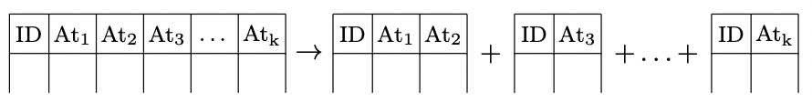

# 35. NoSQL решения: колоночные и графовые БД

## Column-based DB

1. Каждая колонка какого-то отношения хранится фактически как отдельная таблица

2. Хранение нескольких таблиц с дублированием ключевого аттрибута (в пределе переходит к форме ключ-значение)

> Могут быть CA и CP

## Graph DB

1. У узлов есть атрибуты, у связей тоже есть атрибуты
2. Граф кластеризуется таким образом, что узлы в одном кластере связаны значительно сильнее, чем узлы из разных кластеров. Кластеры хранятся отдельно.

> Например, в социальной сети граф можно разделить по принципу “кластер=жители конкретной страны” и хранить кластер, например, на серверах в этой стране.

**Плюсы:**

1. Удобно хранить информацию с неизвестной структурой
2. Удобно для хранения социальных сетей, онтологий, баз знаний

**Пролемы:**

1. Сложный поиск по аттрибутам, но лёгкий по связи.

