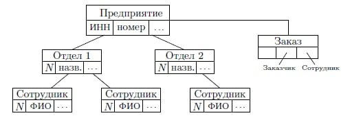

# 7. Иерархическая и сетевая модели данных: составы моделей, преимущества и недостатки

## Иерархическая модель

> Существует только 2 типа связи: `A Kind Of` / `A Part Of`

### Компоненты иерархической модели

1. **Поле данных (аттрибут)** - минимальная неделимая, уникально адресуемая единица хранения данных

2. **Сегмент данных (запись/record/экземпляр данных)** - совокупность полей данных, имеющая уникальную идентификацию (сущность в модели ER).

3. Экземпляр сегмента — конкретные значения полей

4. Дерево — совокупность сегментов, связанных с помощью связи родитель-потомок

**Плюсы:**

1. Более эффективное использование памяти, **относительно** простого хранения данных без какой-либо структуры

2. Более быстрое время выполнения CRUD операций, **относительно** простого хранения данных без какой-либо структуры

**Проблемы:**

1. Требуется много памяти для хранения _(производительность)_
2. Сложно контролировать целостность данных
3. Дублирование данных
4. Скорость операций записи
5. Огромные трудности при реорганизации структуры (иерархии)
6. Невозможна связь `Many-to-many`

## Сетевая модель

- Можно ссылаться много раз на один и тот же объект
- Разделяем хранение связей от хранения данных

**Агрегаты** — так называют сегменты

**Плюсы:**

1. Обеспечивает атрибутивную целостность

**Проблемы:**

1. Храним сущности и связи отдельно
2. Появилась проблема ссылочной целостности

